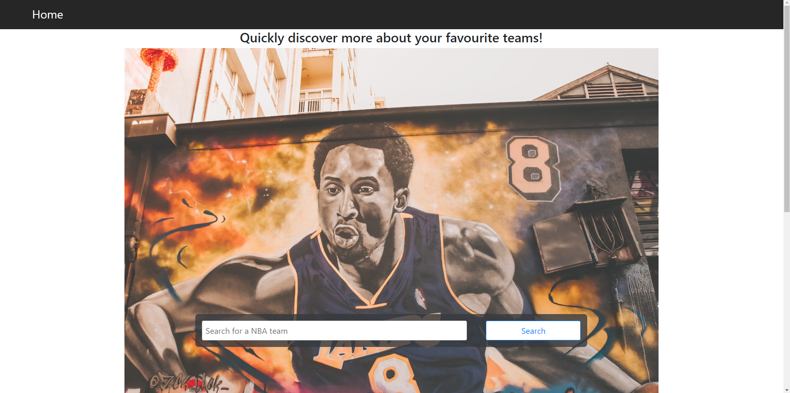
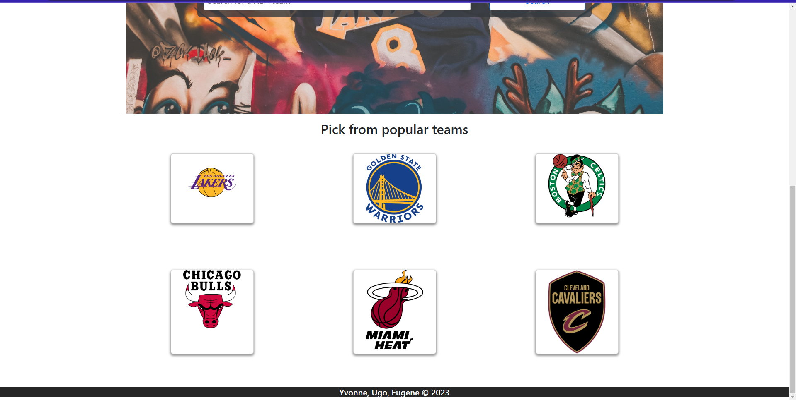
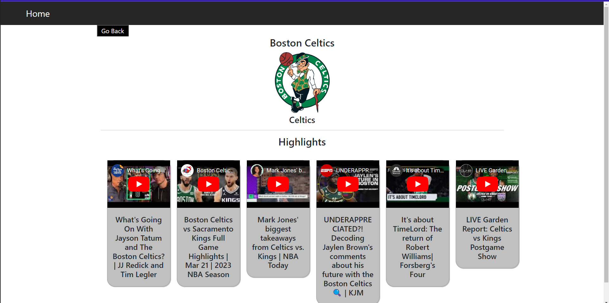
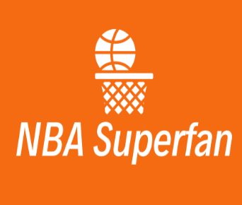

# NBA-superfan

## Quickly discover more about your favourite teams Built by: [Yvonne](https://github.com/yvonnesarah), [Ugo](https://github.com/Ugopreneur) & [Eugeniu](https://github.com/mister-stan)

## Table of Contents

- [Description](#description)
- [Screenshots](#screenshots)
- [Project Link](#project-link)
- [Technologies used](#technologies-used)
- [Future considerations](#future-considerations)
- [Team](#team)
- [Credits](#credits)

## Description

This is an app for NBA fans to get information about their favourite team, watch the team’s highlights, read about their favourite players and subscribe for regular team updates.

#### Who it's made for (target audience)
For NBA fans with busy schedules

## Screenshots

Here are some screenshots of the deployed application in use.

### Starts off with homepage with a search bar and hero image

### Homepage with teams cards

### Results page of teams highlights and youtube videos

## Project Link

Application can be viewed here: 
[Live](https://steady-centaur-494a9d.netlify.app/)

## Technologies used

### Code
- React JS
- JavaScript
- NPM modules: Bootstrap, Axios, Async, Browser

### Skills applied
 Manipulating bootstrap componenets- cards, Managing asynchronous functions with promises, Iterating over arrays with for loops, working with different variable scopes, nested loops and nested functions, complex if/else statements, handling objects with dot notation etc.

### APIs
[RapidAPI](https://rapidapi.com/api-sports/api/api-nba/) & [Youtube API](https://rapidapi.com/Glavier/api/youtube138/)

### Others
    

## Future considerations
Features and improvements to maybe add someday.
1. Improve the styling
2. Use modals instead of alerts
3. Display team information and stats
4. Show players
5. Display recent news about each team
6. Allow users subscribe to email updates

## Team

### Github profiles: [Yvonne (yvonnesarah)](https://github.com/yvonnesarah), [Eugeniu (mister-stan)](https://github.com/mister-stan) & [Ugo (Ugopreneur)](https://github.com/Ugopreneur)

## Credits
A few sources that helped us build this:
- The brilliant APIs we used: [RapidAPI](https://rapidapi.com/api-sports/api/api-nba/) & [Youtube API](https://rapidapi.com/Glavier/api/youtube138/)
- Branding and theme from [Namecheap](https://www.namecheap.com/)
- [chatGPT](https://chat.openai.com/) for guidance when we were lost

